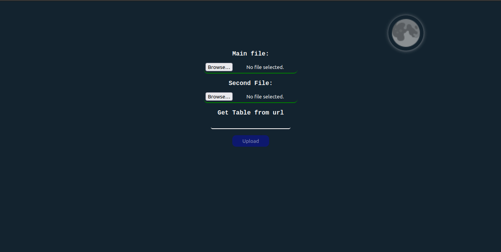

# Tcode
Handle and operate excel and csv files easily.

# App.
https://tcode.mhcode.xyz

#### **If you like the Dark-Ligth theme, you can find it here :)**
https://github.com/marceb1296/react-theme-eclipse

# Installation.

Clone repository:
 `git clone https://github.com/marceb1296/Tcode.git`
 
 > If you only want to see the app running, just up the backend.
 
1. **With Docker.**

    Enter to the project:
    
    `cd Tcode`
    
    Run the command to up docker compose:
    
    `sudo docker compose up`
    
    And images will build automatically.
    After that just access to the url that Docker gives you in the terminal.
    
    #### Note:
    If you want to performs some features in development, you need to do:
    
    - Uncoment the `Volumes` lines in the `docker-compose.yml` file.
    - **In backend/:**
        - Uncomment in `tcode.py` CORS lines.
        - In `Dockerfile` file, comment `deploy` and uncomment development line, after that you need to rebuild the image with the tag: `tcode/backend`.
    - **In frontend/src/:**
        - Uncomment `StrictMode` lines in `App.js`.
        - In `tcodeFileDownload.js` & `tcodeFilesForm.js` files change in `post` function, the url with the content of the line that is above 

2. **Without Docker.**

    Create and get into a virtual environment with python, and create a node environment inside of it (optional, highly recommended).
    
    Enter to the project:
    
    `cd Tcode`
    
    **In backend/:**
    - install requeriments, `pip install -r requirements.txt`
    - Uncomment in `tcode.py` CORS lines. (Only if you want perform in development).
    - Set the name of the flask app in enviroment, `export FLASK_APP=tcode`.
    - Set development env to set flask in developmet mode, `export FLASK_ENV=development` (Only if you want perform in development).
    - Start up the server, `gunicorn --bind 0.0.0.0:5000 tcode:app` or `python -m flask run --host=0.0.0.0` in development.
    - Now you can access to the server through the url that flask gives you in the terminal
    
    **in frontend/:**
    - install project, `npm install --production=false`.
    - If you worried about `high severity vulnerabilities`, `npm audit --production`.
    - Start up the server, `npm start`.
    - If you want to performs some features in development, you need to do:
        - Uncomment `StricMode` lines in `App.js`.
        - In `tcodeFileDownload.js` & `tcodeFilesForm.js` files change in `post` function, the url with the content of the line that is above.

# How it works?

Yo can parse data from Excel & csv files, or by an Url easily

If you upload two files: 
> Will do the same if you upload one file & an Url
- **Main => A & Second => B.**
  - If B has columns that A doesnt have, it will append all B data to A, will do the same if B hasn't data that A does.

If you upload two files & add a Url:
- **Main => A & Second => B & third => C.**
  - If B has columns that A doesnt have, it will append all B data to A, will do the same if B hasn't data that A does. In that way A & B becomes one => AB.
  - If C has columns that AB doesnt have, it will append all C data to AB, will do the same if C hasn't data that AB does.

# What can i do with Tcode?

1. **Operate with one or multiples columns.**

    There's 7 operation you can perform:
      
       Just filter data 
       Copy column      
       (+)              
       (-)              
       (*)              
       (/)              
       (%)              
    
    > 1.- If you want just filter data you don't need to set an output column. 
    2.- If you specify more than one column and want to filter data, conditional will only work for the first column. 
    3.- You can copy only one column. 
    4.- For the others operators you need to specify an output column.

    Beside that, you can set an extra value to those operation.
    > You can only add an extra value with this operations (+, -, *, /, %)

    Usage: + 56 | / 2 | * 5

2. **Delete one or multiples columns.**
3. **FIlter data by conditional.**

    There's 7 type of conditional you can use:

        >
        <
        >=
        <=
        !=
        pk
        d (dates)
        
    Usage: < 67 | >= 67, != 5 | pk 56 | pk 5-26, d > 2012-12-12 | d <= 2012-12-12
    > In date the expected format is ISO 8601 (YYYY-MM-DDTHH:mm:ss.sssZ) 
    Others formats may not work across all browsers.
4. **Create a new column.**

    If you want to rename the data of a column that already exist in the table with the data that you already parse just add the name of it, otherwise you need to specify a new column.
    
5. **Download data as a File.**

    You can download it as a CSV or a Excel (xlsx) file.

Any suggestion, doubt, error or something about this project, please contact me: 
marce_1996hr@hotmail.com 
With the subject **Tcode**.

